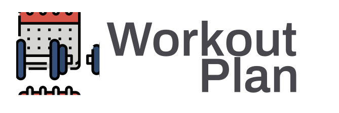

<h2 align="center">
    
</h2>
  
<p align="center">
  

  
  	
  <a href="https://www.linkedin.com/in/gabriel-pereira-oliveira-78b1801ab/">
    
  </a>
	
  
  <a href="https://github.com/Gabrielpdev/workoutPlan/commits/master">
    
  </a>

  
   <a href="https://github.com/Gabrielpdev/workoutPlan/stargazers">
    
  </a>
</p>

## 📝 Conteúdo
<p align="center">
<a href="#about">Sobre</a>&nbsp;&nbsp;&nbsp;|&nbsp;&nbsp;&nbsp;
<a href="#getting_started">Iniciando</a>&nbsp;&nbsp;&nbsp;|&nbsp;&nbsp;&nbsp;
<a href="#built_using">Tecnologias Utilizadas</a>&nbsp;&nbsp;&nbsp;|&nbsp;&nbsp;&nbsp;
<a href="#roadmap">Metas de desenvolvimento</a>&nbsp;&nbsp;&nbsp;|&nbsp;&nbsp;&nbsp;
<a href="#contribute">Como contribuir</a>&nbsp;&nbsp;&nbsp;|&nbsp;&nbsp;&nbsp;
</p>


## 🧐 Sobre <a name = "about"></a>

Workout Plan é um aplicativo onde o usuario cadastra treinos de academia e exercicios para quando for a academia ele ter um cronograma </br>
a seguir, um aplicativo de ficha de academia.


<span align="center">
	
</span>

## 🏁 Iniciando <a name = "getting_started"></a>

Instruções de como acessar as rotas e instalação.

### ⚒ Instalando <a name = "installing"></a>

```
git clone https://github.com/Gabrielpdev/workoutPlan.git

# Necessário tem [Expo][expo] instalado na maquina.
$ yarn 
$ expo start

```

## ⛏️ Tecnologias Utilizadas <a name = "built_using"></a>

As seguintes ferramentas foram usadas na construção do projeto:
- 🔵 [TypeScript][typescript]
- ⚛️ [React Native][reactNative]
- 🔼 [Expo][expo]
- 💅 [Styled-components][styled-components]

## 👨‍💼 Metas de desenvolvimento <a name = "roadmap"></a>

- Desenvolver o sistema de cadastro de treinos.
- Para cada treino é possivel cadastrar ininfitos exercícios.
- É possivel editar/excluir o treino e exercícios.

## 🤔 Como contribuir <a name = "contribute"></a>

- Faça um fork desse repositório;
- Cria uma branch com a sua feature: `git checkout -b minha-feature`;
- Faça commit das suas alterações: `git commit -m 'feat: Minha nova feature'`;
- Faça push para a sua branch: `git push origin minha-feature`.

Feito com ❤️ por Gabriel Pereira 👋🏽 [Entre em contato!](https://www.linkedin.com/in/gabriel-pereira-oliveira-78b1801ab/)

[expo]: https://expo.io/
[typescript]: https://www.typescriptlang.org/
[reactNative]: https://reactnative.dev/
[styled-components]:https://styled-components.com/


